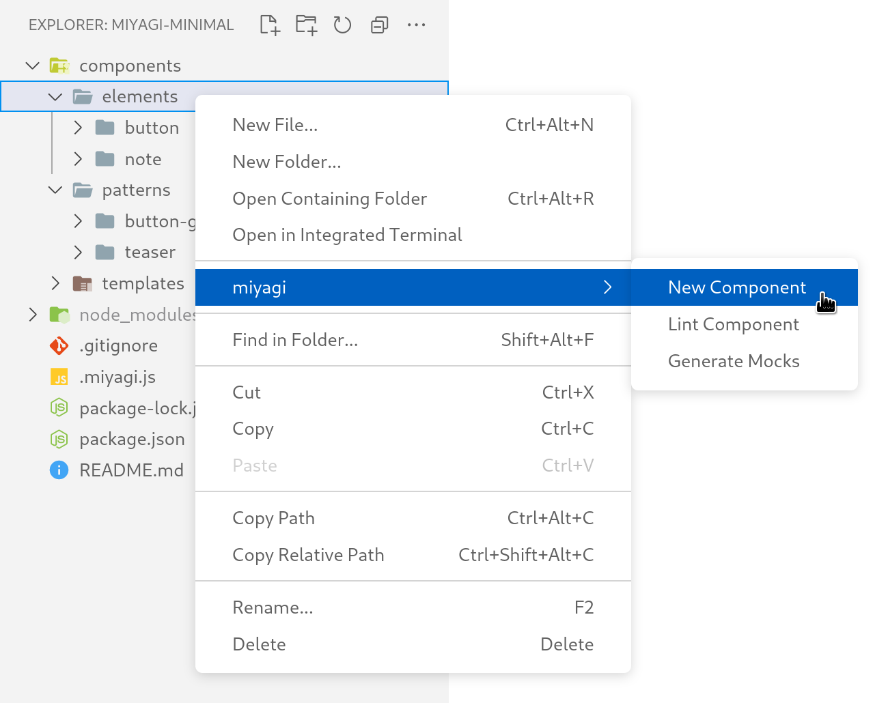
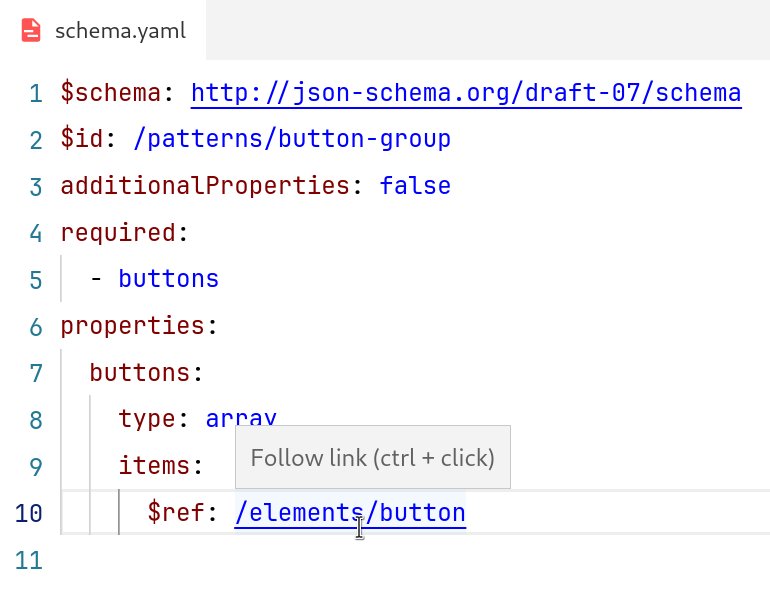

# miyagi for VS Code

Please refer to the [miyagi docs](https://www.miyagi.dev/) for setting up and configuring a project.

## Features

* [Create components](#create-components)
* [Lint components](#lint-components)
* [File links](#file-links)
  * [Schema and mock links](#schema-and-mock-links)
  * [Template links](#template-links)
* [Code completion](#code-completion)
  * [Template completion](#template-completion)
* [Command palette](#command-palette)

## Create components

Create new components by right-clicking on any folder inside your components folder and selecting “New Component”.

## Lint components

Lint components by right-clicking any component and selecting “Lint Component”.

## File links

### Schema and mock links

Linked [`$ref`](https://docs.miyagi.dev/how-to/writing-mock-data/#referencing-other-mock-files) and [`$tpl`](https://docs.miyagi.dev/how-to/writing-mock-data/#referencing-template-files) file references in mocks and schemas.

### Template links

<small>(Twig-only)</small>

Linked template file references in [Twig templates](https://twig.symfony.com/).

## Code completion

### Template completion

<small>(Twig-only)</small>

Properties from schemas are provided as autocomplete items for [IntelliSense](https://code.visualstudio.com/docs/editor/intellisense).

The trigger characters `|` (all types) and `.` (only object and array types) can be used to confirm an item and automatically insert the trigger character. The `|` is used to chain [Twig filters](https://twig.symfony.com/doc/3.x/templates.html#filters). The `.` is used to access [Twig object keys or array indexes](https://twig.symfony.com/doc/3.x/templates.html#variables).

## Command palette

These global commands are accessible in the command palette:

| Command             | Description                                         |
|---------------------|-----------------------------------------------------|
| New Component       | Create a new component by manually entering a path. |
| Lint All Components | Lint the entire miyagi project.                     |
| Reload              | Manually trigger a miyagi config reload.            |

**Note:** The extension automatically reloads when the miyagi config changes. Only use the “Reload” command if the extension stops working.

## Sponsors

